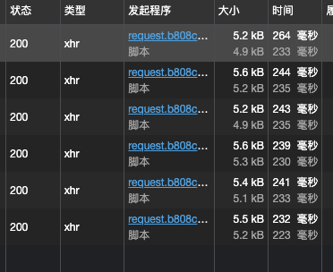

# 性能表现Performance-Test

## 实际生产环境下延迟降低：71.9827586206897%

(Lantency Decrease 71%)

阿里云RDS项目实测

- 原版：
    - 
- 新版：
    - 

## 远距离环境下延迟减少：28.9115646258503%

以下内容仅程序处理时间

Lantency only for the binary file

| Old-Paginator | New-PaginatorWG |
|---------------|-----------------|
| 1144ms        | 971.641152ms    |          
| 1134ms        | 968.76604ms     |
| 1140ms        | 964.523454ms    |
| 1137ms        | 968.157527ms    |
| 1142ms        | 882.433464ms    |
| 1143ms        | 974.042662ms    |
| 1138ms        | 970.14531ms     |
| 1146ms        | 976.033914ms    |
| 1144ms        | 973.388182ms    |
| 1138ms        | 968.376514ms    |
| 1150ms        | 975.206023ms    |

- 极限性能提高：28.9115646258503%
- 最低性能提高：0.17827868852459%

